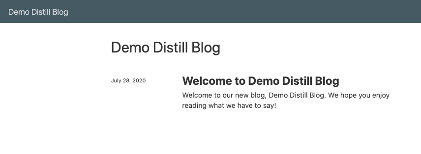
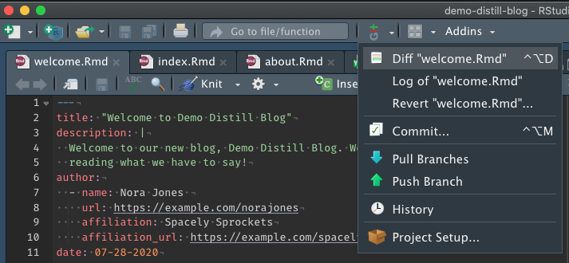
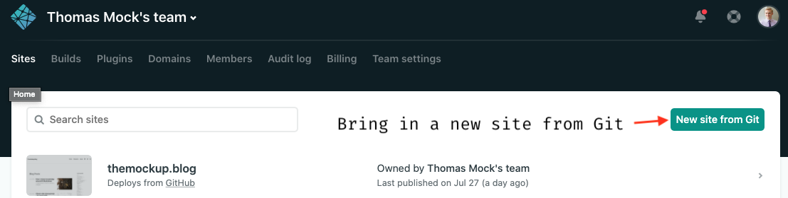
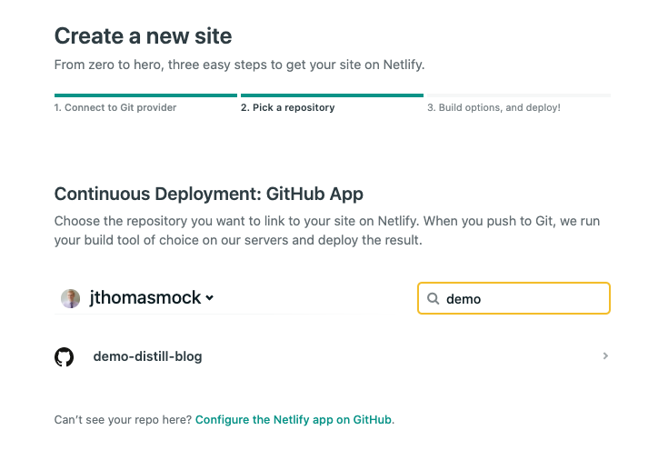
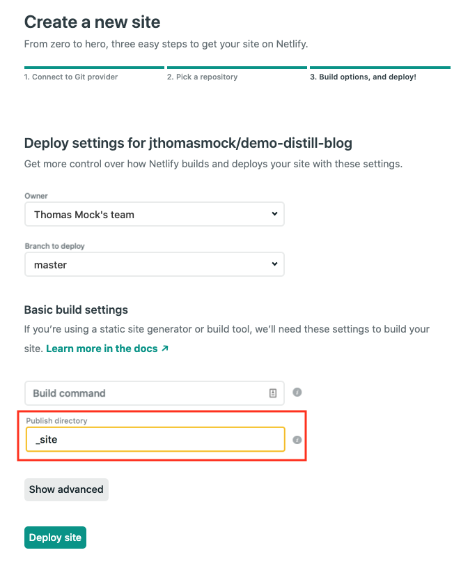

> Note: This post was originally written by [Thomas Mock](https://github.com/jthomasmock) on the [The Mockup blog](https://themockup.blog/) - see the original post [here](https://themockup.blog/posts/2020-08-01-building-a-blog-with-distill/)


# `distill`

`distill` is "Scientific and technical writing, native to the web". I've gotten lots of requests for creating a `distill` blog from scratch, so I've finally gotten around to building that!

Please note that the docs for `distill` are already excellent, check them out at: [Distill: Creating a Blog](https://rstudio.github.io/distill/blog.html). This guide is aimed more at the end-to-end process of creating your first blog.

The **first** blog is typically the hardest and I've lived through the uncertainty of not really understanding how all the pieces work together. I appreciate the simplicity of `distill` for this very reason - there's less **stuff** to change. At its core `distill` is *just* writing articles for a website/blog!

I also have owed this post to many people, namely Maëlle Salmon and JD Long as seen on my [Twitter](https://twitter.com/thomas_mock/status/1287936723843002368?s=20).

## Why consider `distill`?

### Pros

No Hugo dependency, no theme dependency, it’s a very stable format with the ability to customize just enough with a bit of effort. Think a self-hosted `Medium.com` in appearance. Very minimal, lightly themed, focused on writing and code! Again, I think that for someone getting started with creating websites or blogs it's a very good starting point.

With `distill` you render/knit your articles locally, so you can quickly check your work without having to deploy to a git branch or to production. I do think that eventually it is a good idea to have git branches for previews or collaboration, but that's a lot to ask for an initial first stab at a blog/site.

`distill` also natively supports [citations](https://rstudio.github.io/distill/citations.html), footnotes and asides, a rich auto-generated table of contents, support for HTMLwidgets and/or custom javascript, and a reader friendly typography that is mobile friendly/auto-adapts to mobile.

Another nicety is the ability to [import a post](https://rstudio.github.io/distill/blog_workflow.html#importing-a-post) with `import_post()`. This means you can take an existing blogpost from another website and import it into your new blog. This "does not require the original R Markdown document used to author the post—you only need access to the published HTML of a post to import it."

Lastly, I am always amazed at the power of both [`blogdown`](https://github.com/rstudio/blogdown) and the more recent [`hugodown`](https://hugodown.r-lib.org/), but you are still relying on a changing version of Hugo and your theme over time. For a personal blog I *personally* prefer `distill` because I can get busy, neglect my blog for a year, come back to write a new post, and it still *`just works`*.


### Cons

However, `blogdown` and `hugodown` allow dramatically more customization. `distill` is truly an **opinionated** framework, and most of the *easy* customization you can do is fonts, colors, and the navbar. If you expect to create gorgeous custom-layout sites like [education.rstudio.com](education.rstudio.com) or something like Desirée de Leon's [blog](https://desiree.rbind.io/) you’re likely going to be disappointed!

Again, for my blog I really just wanted a simple but in my opinion elegant minimalist theme, so I was fine with the tradeoff, as I would have built something similar with `blogdown` anyway!

`blogdown` also supports other static site generators like Jekyll in place of Hugo, and a rich set of pre-built themes across the various generators. The structure of the site is extensible as well, so you can generate a site that truly looks like your own creation.

Lastly, note that you DO lose some niceties like hugo shortcodes for embedding, and again there is ONLY ONE THEME. Most appearance customization is done at the level of custom CSS.

If you're still with me, here's how to make it!

---

# Steps to create

## Step 1: Install `distill`
* `install.packages("distill”)`

## Step 2: New project from `distill blog`

What this is really doing is running the following command, and generates the output below.

```{r, eval = FALSE, echo = TRUE}
> distill::create_blog(dir = "demo-distill", title = "Demo Distill")
Creating website directory demo-distill
Creating demo-distill/_site.yml
Creating demo-distill/index.Rmd
Creating demo-distill/about.Rmd
Creating demo-distill/_posts/welcome/welcome.Rmd
```

This will create a home-directory titled whatever you passed for the `dir` argument above, so in our case “demo-distill”. This will contain the `_site.yml`, the `about.rmd` file, the `index.rmd` file, and two folders: `_posts` and `_site`. You should definitely change the `dir` and `title` arguments to whatever you want your site to be named, although you can edit this later with a bit of work.

While you’re welcome to explore `_site` I consider it something you SHOULD NOT edit by hand and it will commonly get overridden by rebuilding posts or the whole site. `_site` is essentially where the built site lives as final HTML and other supporting files. The `_posts` folder on the other hand contains all the raw RMDs you will use to create posts.

## Step 3: Preview

At this point the website is technically built! You can “preview” the site by going to:
`_site` -> `index.html`

The `index.html` is essentially the home page for your blog. You can navigate from there in either the RStudio viewer or send it to a web browser just like a normal webpage.

Note: you can also use the `Build Website` button in RStudio to pull up the whole website. This will re-knit and build the entire site from scratch.



## Step 4: `_site.yml`

The `_site.yml` is where you control the overall details about your blog such as the name, title, description, and the navbar. You can add new “tabs” by changing the `_site.yml` file, where the default has a navbar with the site name on the left and a “Home” and “About” Tab on the right.

```{r, eval = FALSE, echo = TRUE}
name: "demo-distill"
title: "Demo Distill"
description: |
  Demo Distill
output_dir: "_site"
navbar:
  right:
    - text: "Home"
      href: index.html
    - text: "About"
      href: about.html
output: distill::distill_article
```

## Step 5: Example blog post

Navigate to `_posts` -> `welcome` -> `welcome.rmd`. This is the default "hello world" example that comes with you `distill`. Note you can delete that folder completely to drop it from the site, but let's use it as a practice ground first.

This is still just a RMarkdown file, but it has a specific YAML header, that contains a title, a description, author, date, and outputs to `distill::distill_article()`.

Try adding some more text, code, or other content to this blog post and then knit it! It will generate and show the final output in the RStudio viewer.

```{r, eval = FALSE, echo = TRUE}
---
title: "Welcome to Demo Distill"
description: |
  Welcome to our new blog, Demo Distill. We hope you enjoy
  reading what we have to say!
author:
  - name: Nora Jones
    url: https://example.com/norajones
    affiliation: Spacely Sprockets
    affiliation_url: https://example.com/spacelysprokets
date: 07-27-2020
output:
  distill::distill_article:
    self_contained: false
---
```

## Step 6: New post

To create a new post, you can run the following command:
`distill::create_post("title of post")`

Full arguments seen below! I'll call out two specific things.

1. `draft` argument: this prevents the post from being included in the site build until you turn it to `FALSE`. This is useful if you're working on a blogpost over time, or want to come back to finish it later.
2. `date_prefix`: this adds a date like `2020-08-01-blog-post` to the front of whatever your `blog-post` name is. This is useful as it also creates a folder structure that sorts properly, and prevents name clashes.

Whenever you run the `create_post()` command it will generate a new folder and the basic RMarkdown doc to get started with the arguments you passed.

```
create_post(
  title, # mandatory
  author = "auto",
  slug = "auto", # generates a website slug (URL)
  date_prefix = TRUE, # adds date for sorting
  draft = FALSE,
  edit = interactive()
)

```

Note that a nice overview of the Blog Post Workflow is covered at the [`distill` site](https://rstudio.github.io/distill/blog_workflow.html). This includes collaborating via Git Branches (or using them as previews). I push to my main branch all the time since I'm working solo.

## Step 7: Add to Git

We’re following instructions at: [Chapter 17 Existing project, GitHub last | Happy Git and GitHub for the useR](https://happygitwithr.com/existing-github-last.html). If you're a Git expert, feel free to use whatever method you like. From my experience setting up a few blogs this is the least painful if you're NOT a Git expert.

<aside> You could also do the create GitHub and then connect it to RStudio route [Chapter 17 Existing project, GitHub last | Happy Git and GitHub for the useR](https://happygitwithr.com/existing-github-last.html#make-and-connect-a-github-repo-option-2). </aside>

NOTE: if you don’t have a GitHub PAT, get one now by following these instructions [B GitHub Personal Access Tokens | Happy Git and GitHub for the useR](https://happygitwithr.com/github-pat.html).

This will first use Git locally, and then create a new GitHub repo based off your existing local files.

Run the `usethis::use_git()` command, which will kick off some questions:

* Don’t commit just yet (Select `3: Not Now`)
* Restart RStudio (Select `2: Yes`)

You will know it all worked when you have the git logo at the top of RStudio



* Click on the Git logo and commit everything, notice we can’t push since
we haven’t configured GitHub yet


* `usethis::use_github()` — this works if you have already configured a GitHub Personal Access Token
  * Next select https if you don’t have SSH keys
  * Say `1: yup` to the title and description

Example of what your console commands are and their output seen below!

```{r, eval = FALSE, echo = TRUE}
> usethis::use_github()
✓ Setting active project to '/Users/thomasmock/demo-distill-blog'
✓ Checking that current branch is 'master'
Which git protocol to use? (enter 0 to exit)

1: ssh   <-- presumes that you have set up ssh keys
2: https <-- choose this if you don't have ssh keys (or don't know if you do)

Selection: 2
● Tip: To suppress this menu in future, put
  `options(usethis.protocol = "https")`
  in your script or in a user- or project-level startup file, '.Rprofile'.
  Call `usethis::edit_r_profile()` to open it for editing.
● Check title and description
  Name:        demo-distill-blog
  Description:
Are title and description ok?

1: Yup
2: No way
3: Negative

Selection: 1
✓ Creating GitHub repository
✓ Setting remote 'origin' to 'https://github.com/jthomasmock/demo-distill-blog.git'
✓ Pushing 'master' branch to GitHub and setting remote tracking branch
✓ Opening URL 'https://github.com/jthomasmock/demo-distill-blog'
```

Once this is all run, it should open up a new webpage with your fancy new GitHub repo! Mine opened at: [GitHub - jthomasmock/demo-distill-blog](https://github.com/jthomasmock/demo-distill-blog).


## Step 8: Netlify

Now that we have our files on Github, we’re ready to deploy via Netlify!

You'll need to Create an account at netlify if you don’t have one already.

### Once you're logged in:


* First click on import from Git



* Click on `Configure netlify on GitHub`, and follow their instructions to allow access, and then add the selected repository you want to send over (demo-distill-blog for me)
  * Click Save!



* Click on `demo-distill-blog` or whatever your blog's name is!

**IMPORTANT**

* Make sure to set the `Publish Directory` to `_site` (so Netlify can find the knitted HTML content)
* And then click deploy!



* You’ll get a fun temporary name (mine was [https://confident-meitner-e6e7dc.netlify.app/](https://confident-meitner-e6e7dc.netlify.app/)). You can change this with the `Domain Settings` to `some-name.netlify.app` or even purchase a custom domain like I did for example `themockup.blog` or what Sharla Gelfand did with `sharla.party`.

Now your website should be up and running! If you don't see a site (it 404s), then I would check to make sure you set the `Publish Director` to `_site`, otherwise it won't know where to find the actual HTML content.

## Step 9: Blog post workflows

> Workflow difference: Furthermore, website pages and root pages of blogs are re-rendered when the site is rebuilt but blog articles are not. Each blog article has to be rendered on its own, with intent. Why? Given that R package upgrades have a tendency to break older code, continuously re-rendering old posts is nearly impossible to do without errors, especially over longer periods of time.

This means you can "Build Site" frequently locally to check out how things work. This is personally the workflow I prefer vs having to commit the output to GitHub or a GitHub branch just to see the preview. You can also knit individual blog posts and they will adapt to your theme, so you can again test local changes whenever you'd like!

To get things into "production" once you have set up Netlify, you'll just need to knit the new blog post, then commit and push to GitHub.

You can use command line git or the git integration in RStudio.


Basic idea is click commit and then push.


# Next Steps

If this guide didn't provide enough detail, make sure to check out the [Blog Post Workflow](https://rstudio.github.io/distill/blog_workflow.html) that goes into specific examples, like importing posts from elsewhere, changing URLs, updating old posts, etc.

Now that you have a website running you can either leave it exactly as it is formatted, and just add new posts or you can do a little bit of customization to the "About Me", Home page, etc.

A lot of options are already covered at [Distill for R Markdown: Creating a Blog](https://rstudio.github.io/distill/blog.html#next-steps)

A few notes:

* If you want Twitter cards to show up with your images, you need to add a `preview: some_img_name.png` argument to the YAML header for each post.
* If you define a custom domain you’ll need to change the [`base_url` at the `_site.yml` file](https://rstudio.github.io/distill/blog.html#Configuration)


## Customize Appearance

Probably of most interest to folks is customizing the appearance of the blog.

* In general the strategy you should use is to inspect parts of the website for the class names and then you can apply CSS to change it
* A nice overview of the "Inspect" tool is covered [here](https://developers.google.com/web/tools/chrome-devtools/open)
* HTML/CSS classes and selectors are covered in the Mozilla docs [here](https://developer.mozilla.org/en-US/docs/Web/CSS/Class_selectors)
* To use a custom CSS file, you’ll need to change the output in `_site.yml` to include the below:

```{r, eval = FALSE, echo = TRUE}
output:
  distill::distill_article:
    css: styles.css
```

I keep my `styles.css` file at the same level as my `_site.yml` file.

### Example changes

You'll need to store all of these in your `styles.css` file, and note that some of them depend on other changes - specifically to use custom fonts you ALSO have to import the custom fonts!

#### Bold silver title, pink background

```{r, eval = FALSE, echo = TRUE}
.distill-site-nav {
  color: #C0C0C0;
  background-color: #FF1493;
  font-size: 20px;
  font-weight: 900;
}
```

#### Want entire webpage to be "pink"?

```
body {
  background-color: #FF1493;
}
```

#### Change hover color in nav bar

```
.distill-site-nav a:hover {
  color: #383838;
}
```

#### Change header font or color
```
/* Change appearance of headers */
h1, h2, h3, h4, h5 {
  font-family: 'Fira Mono', sans-serif;
  color: color: #383838;
}
```

#### Import custom fonts from Google

```
/* Import fonts from Google's API */
@import url('https://fonts.googleapis.com/css2?family=Lato');
@import url('https://fonts.googleapis.com/css2?family=Fira+Mono');
```

#### Use those fonts throughout
```
/* Use specific font in the body of the text */
html, body, p {

  font-family: 'Lato', sans-serif;
  font-weight: 200;
  line-height: 1.3;
  font-size: 1.0em;
  color: #333333;
  font-style: normal;

}
```

#### Change in-line code
```
/* Change the appearance of in-line code chunks */
code {
  font-family: 'Fira Mono', sans-serif;
  color: #383838;
  background: #F5F5F5;
  font-weight: 400;
  font-size: 0.9em;
}
```

#### Change code chunk colors
```
d-code {
  background: grey;
}
```


