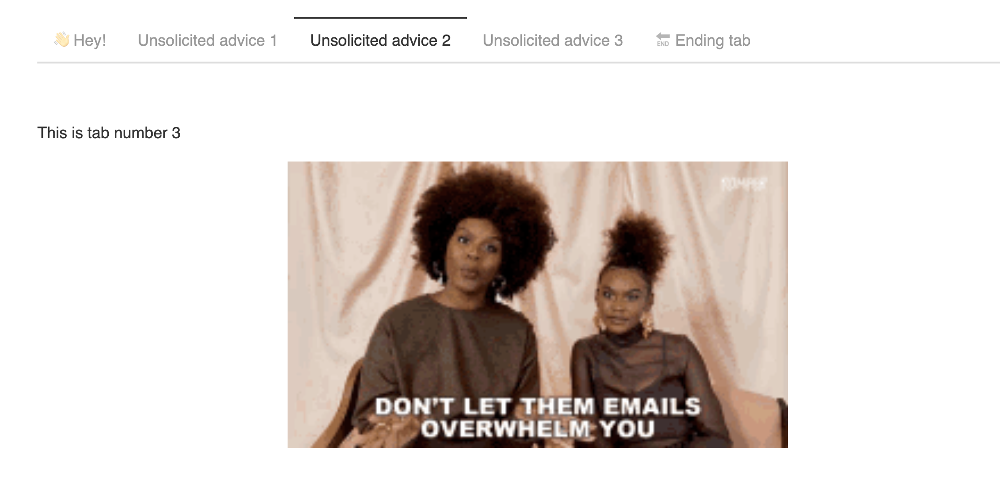

> Note: This post was originally written by [Karina Bartolomé](https://twitter.com/karbartolome) and [Rafael Zambrano](https://rafael-zambrano-blog-ds.netlify.app/) and copied here on March 26, 2021 - see the original post [here](https://karbartolome-blog.netlify.app/posts/automagictabs/) for a potentially updated version.

```{r setup, include=FALSE}
knitr::opts_chunk$set(echo = TRUE,
                      eval = TRUE,
                      warning = FALSE,
                      message = FALSE)
```

# Tidy tabs approach 🧙

When conducting exploratory data analysis 📈, reporting on models 🤖, or simply presenting results obtained, we usually have dozens of plots to show. For this reason, it is necessary to **organize the report** in a way to [focus the reader's attention on certain aspects and not overwhelm them with all the information at once.]{.ul}

👉 We use a [**Tidy approach to generate tabs in automated format**]{.ul} from a nested tibble that contains the objects to include in each tab.

This article is based on a previous article we've written on time series analysis: [Multiple models on multiple time series: A Tidy approach.](https://karbartolome-blog.netlify.app/posts/seriestemporales/)

# Libraries 📚

The necessary libraries are imported. [**sknifedatar**]{.ul} is a package that serves primarily as an extension to the [modeltime](https://business-science.github.io/modeltime/) 📦 ecosystem, in addition to some functionalities of spatial data and visualization. In this case, we are going to use the **automagic_tabs** function from this package.

For data manipulation we used the [**tidyverse**]{.ul} ecosystem.

```{r}
#devtools::install_github("rafzamb/sknifedatar")
library(sknifedatar)
#devtools::install_github("gadenbuie/xaringanExtra")
library(xaringanExtra)
library(lubridate)
library(timetk)
library(dplyr)
library(tidyr)
library(purrr)
library(reactable)
library(htmltools)
```

# What are tabs? 🤔

✏️ A **tab** is a design pattern where content is separated into different panes, and each pane is viewable one at a time.

```{r, echo=FALSE ,fig.align = 'center', eval=FALSE}

```

::: {.l-page}
::: {.panelset}
::: {.panel}
## 👋 Hey! {.panel-name}

This is tab number 1 . 🌟 [**Check the following tabs for some unsolicited advice**]{.ul} 🌟 👆
:::

::: {.panel}
## Unsolicited advice 1 {.panel-name}

This is tab number 2

```{r, out.width="50%",echo=FALSE ,fig.align = 'center'}
knitr::include_graphics('https://media.tenor.com/images/be8a87467b75e9deaa6cfe8ad0b739a0/tenor.gif')
```
:::

::: {.panel}
## Unsolicited advice 2 {.panel-name}

This is tab number 3

```{r, out.width="50%",echo=FALSE ,fig.align = 'center'}
knitr::include_graphics('https://media.tenor.com/images/6a2cca305dfacae61c5668dd1687ad55/tenor.gif')
```
:::

::: {.panel}
## Unsolicited advice 3 {.panel-name}

This is tab number 4

```{r, out.width="50%",echo=FALSE ,fig.align = 'center'}
knitr::include_graphics('https://media.tenor.com/images/bfde5ad652b71fc9ded82c6ed760355b/tenor.gif')
```
:::

::: {.panel}
## 🔚 Ending tab {.panel-name}

This is tab number 5. Thank you for reading this far.

```{r, out.width="50%",echo=FALSE ,fig.align = 'center'}
knitr::include_graphics('https://media.tenor.com/images/3f9ea6897492ac63d0c46eb53ae79b11/tenor.gif')
```
:::
:::
:::

# How to generate tabs? 🗂️

🔹 In order to generate the tabs above, the following chunks were necessary:

```{r, echo=FALSE ,fig.align = 'center', layout='l-body-outset'}
knitr::include_graphics('https://karbartolome-blog.netlify.app/posts/automagictabs/data/tabs.png')
```

```{r, code_folding=TRUE}
# ::: {.l-page}
# ::: {.panelset}
# ::: {.panel}
# ## 👋 Hey! {.panel-name}
#
# This is tab number 1 . 🌟 [**Check the following tabs for some unsolicited advice**]{.ul} 🌟 👆
# :::
#
# ::: {.panel}
# ## Unsolicited advice 1 {.panel-name}
#
# This is tab number 2
#
# ```{r, out.width="50%",echo=FALSE ,fig.align = 'center'}
# knitr::include_graphics('https://media.tenor.com/images/be8a87467b75e9deaa6cfe8ad0b739a0/tenor.gif')
# ```
# :::
#
# ::: {.panel}
# ## Unsolicited advice 2 {.panel-name}
#
# This is tab number 3
#
# ```{r, out.width="50%",echo=FALSE ,fig.align = 'center'}
# knitr::include_graphics('https://media.tenor.com/images/6a2cca305dfacae61c5668dd1687ad55/tenor.gif')
# ```
# :::
#
# ::: {.panel}
# ## Unsolicited advice 3 {.panel-name}
#
# This is tab number 4
#
# ```{r, out.width="50%",echo=FALSE ,fig.align = 'center'}
# knitr::include_graphics('https://media.tenor.com/images/bfde5ad652b71fc9ded82c6ed760355b/tenor.gif')
# ```
# :::
#
# ::: {.panel}
# ## 🔚 Ending tab {.panel-name}
#
# This is tab number 5. Thank you for reading this far.
#
# ```{r, out.width="50%",echo=FALSE ,fig.align = 'center'}
# knitr::include_graphics('https://media.tenor.com/images/3f9ea6897492ac63d0c46eb53ae79b11/tenor.gif')
# ```
# :::
# :::
# :::
```

🔎 As it can be seen, this is not so difficult. However, [**what if we wanted to generate 16 tabs instead of 4?**]{.ul}

```{r, out.width="70%",echo=FALSE ,fig.align = 'center'}
knitr::include_graphics('https://media1.tenor.com/images/6f5f6fdc8187c12a0dc085135d708115/tenor.gif?itemid=3571132')
```

Using a **tidy approach**, [an automatic tab generation]{.ul} 🧙 can be performed by nesting the objects to include in each tab. Let's see an example.

# Data 📊

For this example, time series data from the **Argentine monthly economic activity estimator (EMAE)** is used. This data is available in the [**sknifedatar**](https://rafzamb.github.io/sknifedatar/) package 📦.

```{r}
emae <- sknifedatar::emae_series
```

# Nested dataframes 📂

🔹 The first step is to generate a **nested data frame.** It includes [a row per economic sector]{.ul}.

```{r, eval=TRUE}
nest_data <- emae %>%
  nest(nested_column = -sector)
nest_data
```

👀 To better understand the format of **nest_data**, the "**nested_column"** variable is disaggregated below. By clicking on each sector, it can be seen that 👉👉 [each nested column includes data for the series of the selected sector]{.ul}. In the first row, data corresponds to the monthly activity estimator from 2004-01-01 to 2020-10-01 for the 'Commerce' sector.

```{r, code_folding=TRUE}
reactable(nest_data, details = function(index) {
  data <- emae[emae$sector == nest_data$sector[index], c('date','value')] %>%
    mutate(value = round(value, 2))
  div(style = "padding: 16px",
                 reactable(data, outlined = TRUE)
  )
}, defaultPageSize=5)
```

The above interactive table was made using [**reactable**]{.ul} and [**htmltools.**]{.ul}

# Time series plots 🌠

👉 The evolution of each series can be observed by using a tab for each sector. **This allows the visualization to be much clearer 🙌**, allowing the reader to focus on each series, without having to view multiple plots of the same type.

```{r, eval=TRUE}
nest_data <-
  nest_data %>%
  mutate(ts_plots = map(nested_column,
                        ~ plot_time_series(.data = .x,
                                           .date_var = date,
                                           .value = value,
                                           .color_var = year(date),
                                           .interactive = FALSE,
                                           .line_size = 1,
                                           .smooth_color = 'lightgrey',
                                           .smooth_size = 0.1,
                                           .legend_show = FALSE
                                          )))
nest_data
```

📽 First, a column called "**ts_plots**" is added, where we store the visualizations of the time series. For this we apply the function "**plot_time_series**" on each series stored in the column "**nested_column**" through the function "**map"**. The function **plot_time_series** is included on the [**timetk**]{.ul} package 📦. One of the series is displayed below.Notice that we are using [**lubridate**]{.ul} package to add [different colors for each year]{.ul}. This allows us to infer if [seasonality]{.ul} is present in each time series, although we will analyse this later on this article.

```{r}
nest_data %>% pluck("ts_plots",1)
```

# Perfect, but ... if we wanted to graph all the time series, how could we do it? 🤔

The "**automagic_tabs**" function of the **sknifedatar** package was created for this. It receives 3 main arguments:

-   [x] **input_data**: The nested dataframe that we have created 💾, in our case, the "nest_data" object.

-   [x] **panel_name**: The name of the column of the nested dataframe where the series names are, these names will be the titles of each tabs 📝. In our case, "sector".

-   [x] **.output:** The name of the column of the nested dataframe that stores the graphs to be displayed 📈. In our case, "ts_plots".

**🛠 Additional arguments**: you can specify the width of the set of panels in ".layout", 👉👉👉 [**in addition to being able to specify all the parameters available on rmarkdown chunks**]{.ul} 🙌 (fig.align, fig.width, ...)

🔹 Let's see the application below, first we invoke the "**use_panelset"** function from the [**xaringanExtra**]{.ul} package 📦 and then the "**automagic_tabs**" function.\

```{r, eval=TRUE}
xaringanExtra::use_panelset()
```

```{r, eval=FALSE}
`r automagic_tabs(input_data = nest_data, panel_name = "sector", .output = "ts_plots",
                  .layout = "l-page", fig.heigth=1, fig.width=10)`
```

`r automagic_tabs(input_data = nest_data, panel_name = "sector", .output = "ts_plots",.layout = "l-page", fig.heigth=1, fig.width=10)`

⚠ Note something important, 👉👉👉 [**the function does not run in a chunk, it is invoked "inline"**]{.ul} (or an r function between apostrophes) within the Rmarkdown document. Below is the complete code:

```{r ,eval=FALSE}
#---
#title: "automagic_tabs"
#author: "sknifedatar"
#output: html_document
#---
#
#```{r}
#library(sknifedatar)
#library(timetk)
#```
#
#```{r}
#emae <- sknifedatar::emae_series
#
#nest_data <- emae %>%
#  nest(nested_column = -sector) %>%
#  mutate(ts_plots = map(nested_column,
#                        ~ plot_time_series(.data = .x,
#                                           .date_var = date,
#                                           .value = value,
#                                           .interactive = FALSE,
#                                           .line_size = 0.15)
#                         ))
#```
#
#```{r}
#xaringanExtra::use_panelset()
#```
#
#`r automagic_tabs(input_data = nest_data, panel_name = "sector", .output = "ts_plots")`
```

🔹 **Copy the code above**, paste it into a new Rmarkdown file, and hit knit the document to get the tabs.

```{r, echo=FALSE ,fig.align = 'center'}
knitr::include_graphics('https://karbartolome-blog.netlify.app/posts/automagictabs/data/automagic_tabs_small.gif')
```

# Decomposition and autocorrelation 💡

Below is a brief **exploratory analysis** 💫 of 4 of the series, including **decomposition and autocorrelation** analysis. The results are presented in tabs, one for each sector for each type of analysis.

\
🔹 First we filter 4 series and **add emojis to their names** 😂.

```{r}
data_filter <-
  nest_data %>%
  filter(sector %in% c(
    'Minería',
    'Industria manufacturera',
    'Pesca',
    'Construcción'
  )) %>%
  mutate(
    sector = case_when(
      sector == 'Industria manufacturera' ~ 'Industria manufacturera ⚙️',
      sector == 'Pesca' ~ 'Pesca 🐠',
      sector == 'Construcción' ~ 'Construcción 🏠',
      sector == 'Minería' ~ 'Minería 🏔'
    )) %>%
  arrange(sector)

data_filter
```

🔹 Now [**the decomposition plots are added in the STL column**]{.ul}. This is later plotted with the function **automagic_tabs**.

```{r}
data_filter <- data_filter %>%
  mutate(STL = map(nested_column,
                   ~ plot_stl_diagnostics(.x,
                                          date,
                                          value,
                                          .frequency = "auto",
                                          .trend = "auto",
                                          .feature_set = c("observed", "season", "trend", "remainder"),
                                          .interactive = FALSE
                                          )
))

data_filter
```

📌 STL plots contain 4 nested graphs, [**therefore we will increase the height of the figure to 8 and change the layout**]{.ul}.

```{r, eval=FALSE}
`r automagic_tabs(input_data=data_filter ,panel_name="sector",.output="STL" ,
                  fig.height=5 ,.layout="l-body-outset")`
```

`r automagic_tabs(input_data = data_filter, panel_name = "sector", .output = "STL", fig.height=5, .layout = "l-body-outset")`

🔹 Finally [**the autocorrelation plots are added in the ACF column.**]{.ul} This is also plotted on tabs with the **automagic_tabs** function.

```{r}
data_filter <- data_filter %>%
  mutate(ACF = map(
    nested_column,
    ~ plot_acf_diagnostics(.data = .x, date, value,
                           .show_white_noise_bars = TRUE,
                           .white_noise_line_color = 'red',
                           .white_noise_line_type = 2,
                           .line_size = 0.4,
                           .point_size = 0.7,
                           .interactive = FALSE
                        )
  ))

data_filter
```

```{r, eval=FALSE}
`r automagic_tabs(input_data = data_filter , panel_name = "sector", .output = "ACF",
                  .layout="l-body-outset")`
```

`r automagic_tabs(input_data = data_filter , panel_name = "sector", .output = "ACF",.layout="l-body-outset")`

The emojis are displayed in the tab titles 🤩🤩🤩.

Thank you very much for reading us 👏👏👏.

## Contacts ✉

Karina Bartolome, [Linkedin](https://www.linkedin.com/in/karinabartolome/), [Twitter](https://twitter.com/karbartolome), [Github](https://github.com/karbartolome), [Blogpost](https://karbartolome-blog.netlify.app/).

Rafael Zambrano, [Linkedin](https://www.linkedin.com/in/rafael-zambrano/), [Twitter](https://twitter.com/rafa_zamr), [Github](https://github.com/rafzamb), [Blogpost](https://rafael-zambrano-blog-ds.netlify.app/).
