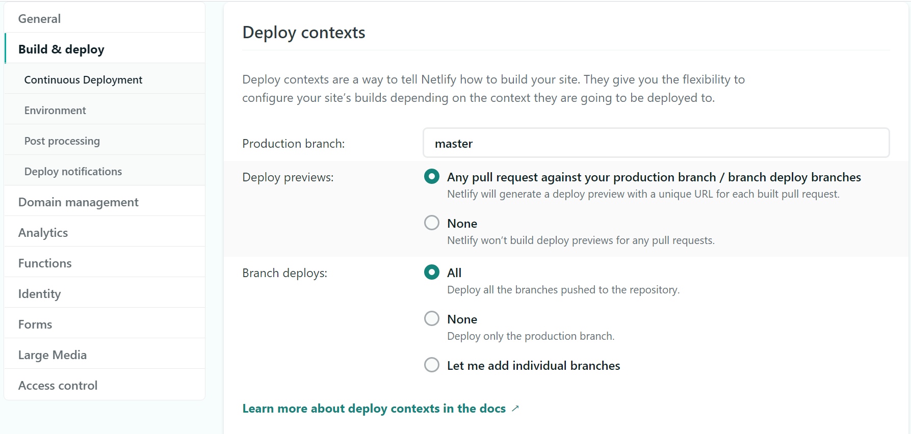

> Note: This post was originally written by [Shannon Pileggi](https://twitter.com/PipingHotData) and was copied here on April 04, 2021 - see the original post [here](https://www.pipinghotdata.com/posts/2021-04-01-deploy-previews-with-netlifly/) for a potentially updated version.

```{r setup, include=FALSE}
knitr::opts_chunk$set(echo = TRUE)
```

# TL; DR

If you are deploying your [{distill}](https://rstudio.github.io/distill/){target="_blank"} website through Netlifly, you can enable [deploy previews](https://docs.netlify.com/site-deploys/overview/#definitions){target="_blank"} to create temporary urls to preview a branch.

# Background

My usual website workflow so far has been to draft posts in my master branch with `draft: true` in the `yaml`, and then when I am ready to publish switch to `draft: false` and commit to my main/master branch. Recently, I've been inspired to try alternative workflows:

<blockquote class="twitter-tweet"><p lang="en" dir="ltr">I’m also a huge convert to the church of making PRs to yourself. Start with an R Markdown project like a simple slide deck or a bookdown book, then get into the habit of every change is a branch + PR. Low cost, but teaches you a lot! <a href="https://t.co/Ee3tuoS4Ef">pic.twitter.com/Ee3tuoS4Ef</a></p>&mdash; Alison Presmanes Hill (@apreshill) <a href="https://twitter.com/apreshill/status/1363104026460577793?ref_src=twsrc%5Etfw">February 20, 2021</a></blockquote> <script async src="https://platform.twitter.com/widgets.js" charset="utf-8"></script>

I also collaborated with someone on a blog post for the first time, and I learned
that you can send links to *preview* branches! `r emo::ji("popper")` For both solo and collaborative posts, this is my new workflow.

I did a quick search for existing guides, and I found that Garrick Aden‑Buie has a comprehensive 2019 blog post titled [A Blogdown New Post Workflow with Github and Netlify](https://www.garrickadenbuie.com/blog/blogdown-netlify-new-post-workflow/){target="_blank"}. Some of the steps are specific to {blogdown}, so here is my {distill} take on it.

# Netlifly settings

First, make sure you have [deploy previews](https://docs.netlify.com/site-deploys/overview/#definitions){target="_blank"} enabled on Netlifly. Login to Netlifly, go to your site, and then:

`r emo::ji("right arrow")` Site settings

`r emo::ji("right arrow")` Build & deploy

`r emo::ji("right arrow")` Deploy contexts

`r emo::ji("right arrow")` Deploy previews

`r emo::ji("right arrow")` Select **Any pull request against your production branch / branch deploy branches** _Netlify will generate a deploy preview with a unique URL for each built pull request._

```{r echo=FALSE, fig.cap='Screenshot of Netlifly settings with Deploy previews set to "Any pull request...".'}

```

# Back in website development

1. Create a branch for your website repository. I am naming my branch `netlifly-deploy-branch`, and in the R console submit:

```{r, eval = FALSE}
usethis::pr_init("netlifly-deploy-branch")
```

2. Create a post. In R console submit:

```{r, eval = FALSE}
distill::create_post("Deploy previews with Netlifly")
```

3. Draft post; set `draft: false` in the `yaml`.

4. Knit post. Depending on what you are doing in your branch, you may also need to `r emo::ji("hammer")` `Build Website`.

5. Commit everything. In terminal submit:

```{r, eval = FALSE}
git add .
git commit -m "draft netlifly post"
```


6. Push to GitHub. In R console submit:

```{r, eval = FALSE}
usethis::pr_push()
```

7. In GitHub, click **"Create pull request"**.

8. Some automatic checks will run. Click on **"Details"** where it says **"Deploy preview ready!"**

```{r echo=FALSE, fig.cap='Screenshot of checks run on GitHub pull request. Click on "Details" where it says "Deploy preview ready!" to open the preview url.'}
knitr::include_graphics("img/netlifly-checks.png")
```

This opens up a window in my browser with the url `https://deploy-preview-3--flamboyant-mccarthy-854a9b.netlify.app/`. Send this link to a friend for review!

9. Edit draft, repeat steps 4-8.

10. When ready to publish, back in GitHub click on **"Merge pull request"**.

_Added April 3, 2020:_

  * [Maëlle Salmon](https://twitter.com/ma_salmon/status/1377844053207879685?s=20){target="_blank"} recommends "Squash and merge" from the drop down menu to create a cleaner commit history.

  * She also recommends deleting branches after merging and provided this link to [Refined GitHub](https://github.com/sindresorhus/refined-github#editing-pull-requests){target="_blank"}, a "browser extension that simplifies the GitHub interface and adds useful features." `r emo::ji("smile")`

I'm new to this workflow and this post was written quickly - edits and suggestions are welcome!

# Acknowledgements

Thanks, [Alison Hill](https://twitter.com/apreshill){target="_blank"}!`r emo::ji("hug")`

Also, thanks for the additional recommendations, [Maëlle Salmon](https://twitter.com/ma_salmon){target="_blank"}!

