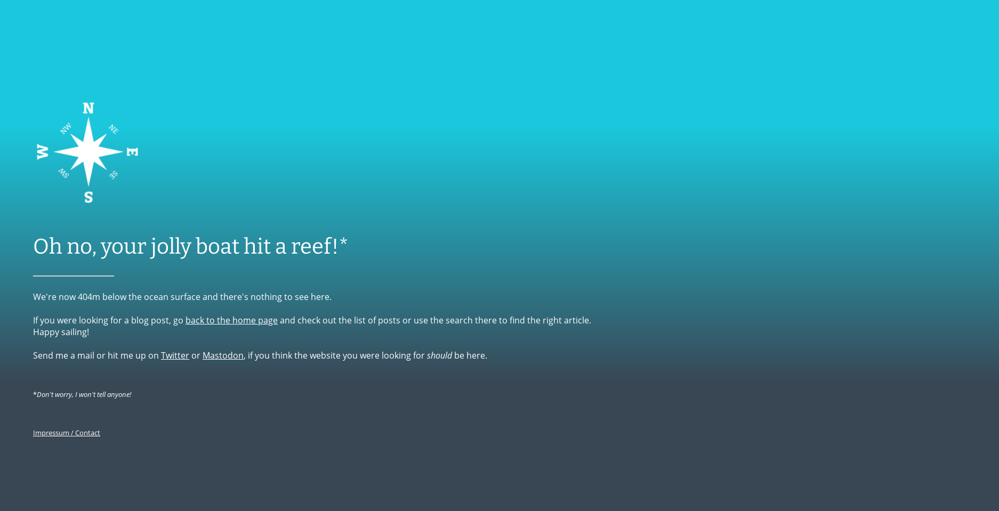

> Note: This post was originally written by [Christian A. Gebhard](https://twitter.com/JollydataB) and copied here on September 21, 2021 - see the original post [here](https://jollydata.blog/posts/2021-08-14-new-additions/) for a potentially updated version.

```{r setup, include=FALSE}
knitr::opts_chunk$set(echo = FALSE, 
                      collapse = FALSE,
                      comment = "#>",
                      fig.retina = 2, # Control using dpi
                      fig.width = 6,  # generated images
                      fig.align = "center",
                      dpi = 72, 
                      out.width = "100%",
                      dev = "png",
                      dev.args = list(png = list(type = "cairo-png")),
                      optipng = "-o1 -quiet")

xaringanExtra::use_panelset()

# source("../../resources/jolly_theme.R", local = knitr::knit_global())
library("r2symbols")
```

<details>
  <summary>Updates</summary>
  
  > **Updated 2021-09-21:** Added paragraph about the actual .htaccess file.
  
</details>

## Introduction

The three changes include a new look for the landing page, a comments functionality and a custom 404 error page. Read on to see how all of this is implemented.

## A clean landing page

I always considered the default landing-on-a-posts-listing a bit awkward. It might be practical to regular users^[but let's be honest...how many might there be?] but it was not really welcoming or eye-pleasing. On the other hand, I also didn't want to have a separate landing page with a link to the posts listing. I still want to have the listing on the starting page, as this blog is mainly about the content, not to showcase my CV or other content.

### The Idea: parallax scrolling
The design I chose, is a screen-filling background image, with a simple welcoming message. When scrolling down, the post listing appears. To have a modern look, I wanted to have a parallax scrolling effect, which means showing different scrolling speeds for different layers of the page. The example GIF shows the effect in action.

<aside>
<a title="NuclearDuckie, CC0, via Wikimedia Commons" href="https://commons.wikimedia.org/wiki/File:Parallax_scroll.gif"></a>
</aside>

### Implementation
The default index.Rmd that is generated when you set up a distill blog, only contains a three line YAML header and looks like this:

```
---
title: "The name you chose"
site: distill::distill_website
listing: posts
---
```

Conveniently, it seems that distill appends the posts listing to whatever content you put into this index.Rmd. To implement my new landing page I added basic HTML and CSS to the file. As I'm not experienced with either, the result is a patchwork of snippets from stackoverflow answers and w3schools examples, glued together by trial and error. The final result looks like this:

```{html, eval=FALSE}
---
title: "Posts"
site: distill::distill_website
listing: posts
---

<style>
    .parallax { 
    
        /* Set the background image */
        background-image: url("sailplot.png");
    
        /* Use the full viewscreen height as height */
        height: 100vh; 
        
        /* Set the background to create the parallax scrolling */
        /* this does not work on iOS mobile devices */
        background-attachment: fixed;
        background-position: center;
        background-repeat: no-repeat;
        background-size: cover;
    }
    
    .welcome {
      position: absolute;
      left: 0;
      top: 35vh;
      width: 100vw;
      text-align: center;
      color: #000;
    }
    
    .welcome span.title {
      font-family: 'Bitter', serif;
      font-weight: bold;
      color: #000;
      font-size: 42px;
      letter-spacing: 10px;
      line-height: 1.6;
    }
    
    .welcome span.surrounding {
      font-family: 'Bitter', serif;
      color: #000;
      font-size: 20px;
      letter-spacing: 5px;
    }
    
    .welcome span.downarrow {
      font-size: 42px;
    }
    
    
    .downbutton {
      background: rgba(0,0,0,0);
      border: none;
      outline: none;
      color: #1BC7DC;
      -moz-opacity: 0.75;
      -khtml-opacity: 0.75;
      opacity: 0.75;
      text-align: center;
      font-size: 42px;
    }

</style>

<!-- Here comes the actual HTML content: -->

<div class="parallax l-screen">

  <div class="welcome">
  
    <span class="surrounding">Welcome to the</span>
    <br><br><br>
    <span class="title">jolly data blog</span>
    <br><br><br>
    
    <span class="downarrow">
    
      <!-- The script provided in the onclick attribute allows to click the down button and triggers a smooth scroll down to the posts listing. -->
      
      <button class="downbutton" onclick="window.scroll({ top: window.innerHeight+50,  left: 0,  behavior: 'smooth' });">
        
      </button>
      
    </span>
  </div>
</div>

```

The "sailplot.png" was generated using R. If you're interested, check out the [code](https://github.com/nucleic-acid/jolly-data-resources/blob/main/code/R/sailplot.R). The "chevron.png" was drawn using *Inkscape*.

### The result
You can checkout the resulting page [here](https://jollydata.blog). There is an important note: I couldn't get the parallax scrolling effect to work on mobile iOS-devices. On an iPhone and iPad, that I could use for testing, the background image *sailplot.png* was not shown. Instead, the background was plain white. As far as I can tell after briefly looking around the web, it seems that mobile webkit engines explicitly do not support this effect in order to limit the resource demands.^[I dug this up on page gazillion of a random forum somewhere on the internet, so don't take this as definite / official explanation.] As a clean white background didn't look too bad either, I chose to let it that way. A skilled web developer might get this to work on any device.

If you like the design, have ideas for improvement (or even a solution to the iOS problem), *leave a comment below!*

**Wait, what?** Yes, you can now leave comments below the posts. Read on to find out more!^[I'm so sorry for this cheap transition, it just overcame me.]

## Comment function via Utterances

I'm always happy to interact with the R / Python / data science community but until now I only offered e-mail, Twitter or Mastodon as means of communication. While this may be easy for some, it might be too much of a hurdle for readers to "just leave a short note". I hope to offer a more direct way to react to the posts by offering a comment functionality right below every blog post.  
To achieve this, I use the utterances widget. The creators of the widget describe it as:

> A lightweight comments widget built on GitHub issues. Use GitHub issues for blog comments, wiki pages and more!
> (see [https://utteranc.es](https://utteranc.es))

According to the developers it's open source and doesn't come with any sort of tracking or ads.

The comments are stored in a [public repository](https://github.com/nucleic-acid/comments.jollydata.blog) as comments to a GitHub issue^[For each blog post, a new issue is created, thereby allowing for separate comment feeds for each blog post.]. This means that, in order to comment, you need a GitHub account. While this might put some readers off^[You can still send me an E-Mail if you want!], I assume most of you have an account there anyways.

For the *"How to"* I'd like to refer to the great instructions at [Miles McBain's blog](https://milesmcbain.micro.blog/2020/09/04/how-i-got.html), that I followed closely. Based on his HTML template, I created mine, which is accessible [here](https://github.com/nucleic-acid/jolly-data-resources/tree/main/code/HTML_CSS).

Overall, setting it up was much easier than I expected!

## Custom 404 error page
In theory this one is pretty straight forward: make a nice HTML file, put it somewhere in the root directory of your website and tell the webserver to use that file instead of the rather boring default "404 not found" error.

In my case this was as easy as putting the following line into a file called `.htaccess` in the site's root directory:

```
ErrorDocument 404 /404.html
```
I suppose this should be valid for all Apache Webservers. Many webhosters might offer a frontend to manage this, but if you're using github pages or Netlify I suppose you'd have to create the file manually.^[I haven't tried this myself on these services-]

Now let's get to the part(s) where this got tricky. Most importantly, there are three players to consider: you (as in your HTML/CSS skills), the blogging framework you use (distill in this case) and the webserver (which is often operated by a web-hosting service).

### First attempt
If you're not experienced in web development, I suggest using some sort of static website building tool, as did I. Within the R/Rmarkdown universe there's the great `{postcards}` package, that converts simple markdown into nice static pages using beautiful templates. An example is the [about page](https://jollydata.blog/about.html), but there are many more possibilities.

I modified the `postcards::onofre` theme to my liking and was satisfied with the outcome:

```{r, echo=TRUE, include=TRUE, fig.cap="The first attempt to build a custom 404 error page.", fig.alt="A screenshot of a page generated with the {postcards} package. It shows a customized message for the '404 not found' error. The static website showing the message is built into the surrounding blog content, including the navigation bar at the top and the footer of the blog with copyright and legal requirements."}
knitr::include_graphics("images/embedded.png")
```

I even pushed this to my production system and only discovered the problem there: the distill framework seems to work with relative URLs mostly. While this might be beneficial in many cases, it created a problem for the custom 404 page (probably in conjunction with my hoster's server setup.)

The 404.html is located in my website's root directory. So all relative links from within this directory work fine: when loading a wrong URL in the base-directory such as "https://jollydata.blog/error_test.html" the page is rendered correctly, as seen in Fig. 1.

Now, when I tried to misspell the URL of a blog post, e.g. https://jollydata.blog/posts/2021-06-12-tt-fish~~ing~~, the error page was completely broken. All links from the navbar and the footer pointed to wrong relative locations such as https://jollydata.blog**/posts/**about.html. It seems that the webserver loads the 404.html from the root directory, but stays in the subdirectory /posts/ as base for the relative links. In addition this even broke the layout of the page.

This *could be* a problem *specific to my hosting service*. If you want to include a custom 404 page, I suggest trying to build a simple static page with e.g. `{postcards}` and see if this works with your webhosting first, before following along with my second (successfull, yet tedious) attempt.

Sadly, I didn't find a solution in the webhoster's server settings that did the trick. This is why I went back to the start and tried again.

### Second attempt

I really liked the postcards-version of my custom 404 error page. But I had to avoid loading the nav-bar, the footer and any layout-related scripts/frameworks built into `{distill}`.

Basically I opted for copying the layout with plain HTML/CSS and use that as a self-contained page without the bells-and whistles of the `{distill}` framework. This meant building it almost from scratch^[As mentioned above already, I'm not experienced with web development and the resulting website is a patchwork of snippets mostly from stackoverflow answers and w3schools examples, glued together by trial and error.]. The only thing I import is my customized "main"-CSS file to keep the font styles consistent with the rest of the blog.

The resulting page looks quite similar:

```{r fig.cap="The second attempt to build a custom 404 error page.", fig.alt="A screenshot of the manually programmed facsimile. It shows the same message as in Fig. 1. The only difference is, that it does not have the blog's navigation bar and footer."}

```

In this manually created page I only use absolute URLs so independently of what the webserver "does" the reader will always end up on the right page. If you want to check it out, feel free to mess up the URL and enjoy the view. For convenience click [here](https://jollydata.blog/donotgohere.html). If you're interested into my 404.html, it is accessible [here](https://github.com/nucleic-acid/jolly-data-resources/blob/main/code/HTML_CSS/custom_404.html).

## Comments

I really enjoyed tweaking the jollydata.blog! However I sometimes reached the limits of my web development skills and maybe found sub-optimal solutions. Are you aware of easier ways to achieve the above extensions? Are you missing vital details to apply any of the above to your blog? Please leave a comment here:
