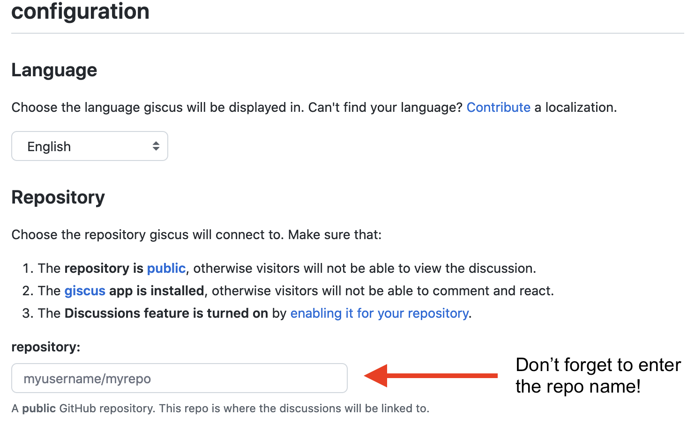

<!--------------- setup post ----------------->

```{r setup, include=FALSE}
knitr::opts_chunk$set(echo = TRUE)
refinery::renv_load(paste(params$date, params$slug, sep = "_"))
```

```{r xaringanExtra-clipboard, echo=FALSE}
# Enable copy-paste of code chunks
# xaringanExtra::use_clipboard()
htmltools::tagList(
  xaringanExtra::use_clipboard(
    button_text = "<i class=\"fa fa-clipboard fa-2x\"></i>",
    success_text = "<i class=\"fa fa-check fa-2x\" style=\"color: #90BE6D\"></i>",
    error_text = "<i class=\"fa fa-times-circle fa-2x\" style=\"color: #F94144\"></i>"
  ),
  rmarkdown::html_dependency_font_awesome()
)
```

<!--------------- post ----------------->

> Note: This post was originally written by [Joel Nitta](https://twitter.com/joel_nitta) and copied here on November 29, 2021 - see the original post [here](https://joelnitta.com/using-giscus) for a potentially updated version.

## TL;DR

- [giscus](https://github.com/giscus/giscus) is a free, open-source commenting system for blogs that uses the GitHub API
- giscus uses GitHub Discussions (not Issues) to store data
- I show how to enable giscus on a Distill blog

```{r featured}
#| echo = FALSE,
#| fig.cap = "Image by [Adam Solomon](https://unsplash.com/@solomac) on [unsplash](https://unsplash.com/photos/WHUDOzd5IYU)." 

knitr::include_graphics("img/adam-solomon-WHUDOzd5IYU-unsplash.jpg")
```

Like many R-bloggers these days, I have made some changes: I switched from [blogdown](https://github.com/rstudio/blogdown) to [Distill](https://github.com/rstudio/distill)
^[blogdown and Distill are R packages for making websites. In a nutshell, Distill is much simpler to use than blogdown, at the cost of some design flexibility. For more about making the switch, you can get caught up with posts from [Thomas Mock](https://themockup.blog/posts/2020-08-01-building-a-blog-with-distill/), [Frie Preu](https://frie.codes/posts/tricks-blogdown-to-distill/), [Lisa Lendway](https://education.rstudio.com/blog/2021/02/distill-it-down/), and [Andreas Handel](https://www.andreashandel.com/posts/distill-github-website/).],
and from disqus to [utterances](https://github.com/utterance/utterances)
^[disqus and utterances are tools that let users comment on blog posts. Recently many R-bloggers have been [moving away from disqus](https://twitter.com/hrbrmstr/status/1135915244532822018) because it has a habit of [tracking user's data](https://nanx.me/blog/post/migrating-from-disqus-to-utterances/) and [causing page bloat](https://victorzhou.com/blog/replacing-disqus/). More recently, when I checked on my disqus account (in the process of migrating away!), it had a option to "opt-out" of data tracking, but that means data-tracking is **on** by default.].
Several things about utterances appealed to me: **free**, **open-source**, **no data tracking**. But when I started using it, I immediately was turned off by the dual use of GitHub issues as a way to store comments. It just felt odd to have an issue that wasn't an issue!

Fortunately, [I'm not the only one to feel this way](https://github.com/utterance/utterances/issues/324), and [`@laymonage`](https://laymonage.com/) actually [did something about it](https://laymonage.com/posts/giscus): there is now a very similar app to utterances, [called giscus](https://github.com/giscus/giscus). It offers almost the same functionality, but **it uses GitHub Discussions as the place to store comments** instead of Issues. This makes much more sense to me.

There are several blogposts
^[For example, [Vebash Naidoo's tutorial](https://sciencificity-blog.netlify.app/posts/2021-02-20-enable-utterances-with-distill/) and [Michael McCarthy's post describing how to control the location of the comments section](https://tidytales.ca/posts/2021-06-19_distill/).]
on how to enable utterances on Distill, but none that I've found so far on giscus. So, here goes!

1. [Enable Discussions on your blog repo](https://docs.github.com/en/discussions/quickstart). Optionally, if you want to use a non-default Discussions category for storing giscus content, [add a new category](https://docs.github.com/en/discussions/managing-discussions-for-your-community/managing-categories-for-discussions-in-your-repository). I did this and called it "Comments". As recommended by giscus, it's a good idea to [set the discussion format](https://docs.github.com/en/discussions/managing-discussions-for-your-community/managing-categories-for-discussions-in-your-repository) to "Announcement" so that non-authorized users can't add content via the Discussions interface (only the giscus widget on your blog).

2. [Install the giscus GitHub app](https://github.com/apps/giscus) and configure it to have access to your blog's repo.

3. [Go to the giscus app interface](https://giscus.app/), scroll down to "configuration" and fill in the details for your blog. Once you've done so, further down you should see an HTML code block under "Enable giscus" populated with your information.

```{r giscus-config}
#| echo = FALSE,
#| fig.cap = "[giscus](https://giscus.app/) configuration menu." 

```

```{r giscus-html, echo = FALSE}
#| echo = FALSE,
#| fig.cap = "[giscus](https://giscus.app/) HTML block. Once you fill in the fields in the configuration menu, the parts starting with `[ENTER ...]` will get automatically populated." 
knitr::include_graphics("img/giscus-enable.png")
```

As described in [Miles McBain's blogpost](https://milesmcbain.micro.blog/2020/09/04/how-i-got.html), unfortunately in Distill, you can't just paste the HTML directly into an Rmd file. It won't show up. But the same work-around that he describes for utterances also happily works for giscus! Read on...

5. Add an `.html` file (I've called mine `giscus.html`) to the root of your blog repo that looks like this (and is based off of [Miles' HTML](https://milesmcbain.micro.blog/2020/09/04/how-i-got.html)):

```{html, eval = FALSE}
<script>
   document.addEventListener("DOMContentLoaded", function () {
     if (!/posts/.test(location.pathname)) {
       return;
     }

     var script = document.createElement("script");
     script.src = "https://giscus.app/client.js";
     script.setAttribute("data-repo", "[ENTER REPO HERE]");
     script.setAttribute("data-repo-id", "[ENTER REPO ID HERE]");
     script.setAttribute("data-category", "[ENTER CATEGORY NAME HERE]");
     script.setAttribute("data-category-id", "[ENTER CATEGORY ID HERE]");
     script.setAttribute("data-mapping", "pathname");
     script.setAttribute("data-reactions-enabled", "0");
     script.setAttribute("data-emit-metadata", "0");
     script.setAttribute("data-theme", "light");
     script.setAttribute("data-lang", "en");

     /* wait for article to load, append script to article element */
     var observer = new MutationObserver(function (mutations, observer) {
       var article = document.querySelector("d-article");
       if (article) {
         observer.disconnect();
         /* HACK: article scroll */
         article.setAttribute("style", "overflow-y: hidden");
         article.appendChild(script);
       }
     });

     observer.observe(document.body, { childList: true });
   });
 </script>
```

If you compare the above code with the HTML block in the giscus app (Fig. \@ref(fig:giscus-html)), you should be able to see how the `script.setAttribute` lines above map to the key-value pairs in the HTML block in the giscus app. All we have to do is copy the contents of the HTML block over to this `giscus.html` file. You can [see what my `giscus.html` file looks like here](https://github.com/joelnitta/joelnitta-home/blob/047152c2d1c6cfdeee438b6e23453d4330ece6ef/giscus.html).

6. [Modify `_site.yml`](https://rstudio.github.io/distill/website.html#site-output) so that the `giscus.html` file gets loaded on every Distill article page
^[The `_site.yml` file is longer than this, but I'm just showing the relevant code to add. You can [see my `_site.yml` file here](https://github.com/joelnitta/joelnitta-home/blob/047152c2d1c6cfdeee438b6e23453d4330ece6ef/_site.yml).
]:

```
output: 
  distill::distill_article:
    includes:
      in_header: giscus.html
```

**That's it!** Or it should be anyways. I recommend trying a test comment to make sure everything is working (nobody will tell you otherwise...)
