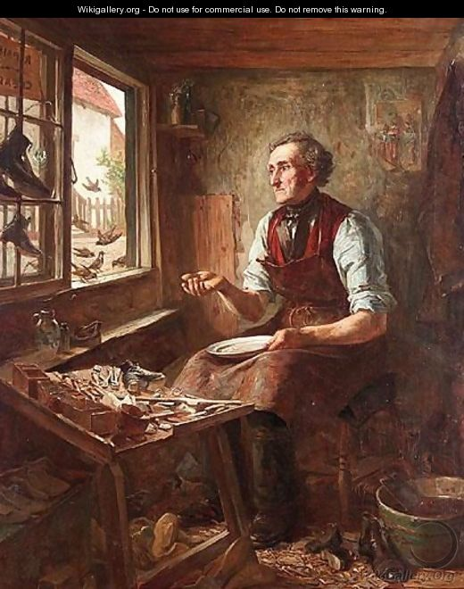

<!-- TOC JAVASCRIPT ELEMENTS -->
<script>
function toggle () {
  document.getElementById("TOC").classList.toggle("hide");
};

window.addEventListener('DOMContentLoaded', () => {

  const observer = new IntersectionObserver(entries => {
    entries.forEach(entry => {
      const id = entry.target.getAttribute('id');
      if (entry.intersectionRatio > 0) {
        document.querySelector(`[href="#${id}"]`).parentElement.classList.add('active');
      } else {
        document.querySelector(`[href="#${id}"]`).parentElement.classList.remove('active');
      }
    });
  });

  // Track all headings that have an `id` applied
  document.querySelectorAll('h1[id], h2[id], h3[id], h4[id], h5[id], h6[id]').forEach((h1, h2, h3, h4, h5, h6) => {
    observer.observe(h1, h2, h3, h4, h5, h6);
  });
  
});
</script>

<!-- TOC HTML ELEMENTS -->
<input type="button" class="d-article-with-toc" id="TOC" value="&#x2630" title="Toggle (Hide/Show) Table of Contents" alt="Toggle button for hiding/showing the Table of Contents" onclick="toggle()" style="padding:7px; border: 0px;"/>

```{r setup, include=FALSE}
knitr::opts_chunk$set(echo = FALSE)
```

> Note: This post was originally written by [Radovan Miletic](https://twitter.com/RadovanMiletic) and copied here on April 18, 2022 - see the original post [here](https://radovan-miletic.github.io/distill-blog/posts/2022-01-24-the-toc-in-distill/) for a potentially updated version.

{target="_blank" width=70% .external}

## Crumbs from a poor man's table (of contents)

You may find the crumbs [here](https://github.com/radovan-miletic/distill-blog/tree/main/_posts/2022-01-24-the-toc-in-distill){target="_blank"}: `toc-styles.css` and `the-toc-in-distill.Rmd`. Hope they will be inspirational to someone.  

Judging by the {[distill](https://github.com/rstudio/distill){target="_blank"}} issues [16](https://github.com/rstudio/distill/issues/16){target="_blank"}, [341](https://github.com/rstudio/distill/issues/341){target="_blank"}, [366](https://github.com/rstudio/distill/issues/366){target="_blank"}, [420](https://github.com/rstudio/distill/issues/420){target="_blank"}, and the Stack Overflow [question](https://stackoverflow.com/questions/67323162/floating-toc-in-distill-for-r){target="_blank"} it seems that there is a genuine need for some kind of a "floating TOC on the side" in {distill}.  

In his [comment](https://github.com/rstudio/distill/issues/16#issuecomment-692207662){target="_blank"}, J.J. Allaire summarizes the problem:  
- any change in {distill} should be linked to [distll.pub](https://github.com/distillpub/template){target="_blank"} web framework,  
- floating TOC on the side would be tricky to implement due to specific layout "figures that extend into the sidebar (quite common w/ distill)".  

An optimal solution can be found within [Quarto](https://quarto.org/docs/websites/website-navigation.html){target="_blank"} publishing system. You may try scrolling up and down and observe the collapsible sidebar navigation. HTML documents rendered with Quarto use Bootstrap 5 by default, which is not the case with distill.pub.

While we wait for a solution, you may feel tempted to try "a poor man's TOC" that I came up with for my use case (applied to single article).  
Let me know how it goes!  

### Floating TOC in fixed position  

```{r panelset, echo=FALSE}
xaringanExtra::use_panelset()
```

::::: {.panelset}
::: {.panel}
#### YAML output

You may include a `toc-styles.css` file in the post directory and add a reference to it in YAML output options: `css: toc-styles.css`.

``` {.yaml}
title: "Post title"
description: |
  Description
author:
  - first_name: "R"
    last_name: "M"
output:
  distill::distill_article:
    toc: true
    toc_depth: 6
    toc_float: true
    css: toc-styles.css
    self_contained: false
```
:::  

::: {.panel}
#### CSS elements

If you want to place the TOC below the figures, you need to disable the [z-index](https://developer.mozilla.org/en-US/docs/Web/CSS/z-index?){target="_blank"}.

``` {.css}
/* This hack is needed to temporary disable the predefined layout style */
d-article {
    contain: none;
  }

/* Sidebar Navigation */
#TOC {
  opacity: 1;
  position: fixed;
  left: calc(7%);
  top: calc(5.5%);
  /* width: 20%; */
  max-width: 260px;
  max-height: 85%;
  overflow-y: auto;
  background: white;            /* Optional, remove to enable the blur filter (just for fun). */
  backdrop-filter: blur(10px);  /* Optional, wouldn't not work with Firefox browser. */
  padding: 10px;                /* Optional */
  /* border-right: 1px solid rgba(0, 0, 0, 0.1); */
  border: 1px solid rgba(0, 0, 0, 0.1);
  /* border-radius: 1px; */
  transition: all 0.5s;
  z-index: 999;                 /* Optional */
  }

/* Hide the TOC when resized to mobile or tablet:  480px, 768px, 900px */
@media screen and (max-width: 1000px) {
#TOC {
    position: relative;
    left: 0;
    top: 0;
    max-width: none;
    max-height: none;
    overflow-y: auto;
    border: none;
    background: none; }
  }
```
::: 
:::::  

### Toggle (show/hide) button   

::::: {.panelset}
::: {.panel}  
#### CSS elements

You may disable the hover effect, if preferred.

``` {.css}
.d-contents nav h3 {
    text-indent: 25px;
  }

#TOC.hide { 
  opacity: 0;
  transition: visibility 0s linear 0.5s, opacity 0.5s;
  }

/* Optional, remove to disable the hover effect */
#TOC:hover {
  opacity: 1;
  transition: all 0.5s;
  }

/* Hide the TOC when resized to mobile or tablet:  480px, 768px, 900px */
@media screen and (max-width: 1000px) {
#TOC {
    }
    .d-contents nav h3 {
      text-indent: 0; }
    input[type="button" i] {  
      display: none; }
  }
```
::: 

::: {.panel}
#### JAVASCRIPT elements

``` {.js}
function toggle () {
  document.getElementById("TOC").classList.toggle("hide");
};
```
::: 

::: {.panel}
#### HTML elements

``` {.html}
<input type="button" class="d-article-with-toc" id="TOC" value="&#x2630" 
title="Toggle (Hide/Show) Table of Contents" 
onclick="toggle()" style="padding:7px; border: 0px;"/>
```
:::  
::::: 

### Scrolling Active States  

It was Rich Pauloo (author of Stack Overflow question mentioned above) who pointed out to a scrolling active state implementation, "such that the TOC responds to the header the user is currently on".

All credits for "scrolling active state" lightweight solution goes to Bramus Van Damme (see his [tutorial](https://www.bram.us/2020/01/10/smooth-scrolling-sticky-scrollspy-navigation/#step3){target="_blank"}) and Chris Coyier (his [tutorial](https://css-tricks.com/sticky-table-of-contents-with-scrolling-active-states/){target="_blank"}) and to the powerful [IntersectionObserver](https://developer.mozilla.org/en-US/docs/Web/API/Intersection_Observer_API){target="_blank"}.  

I just made slight changes needed to track all headings that have an `id` applied.  
Please note that `IntersectionObserver` will only observe changes in document's viewport, in our case - headings currently being displayed on the screen.

::::: {.panelset}
::: {.panel}
#### CSS elements

``` {.css}
/* ScrollSpy active styles (see JAVASCRIPT tab for activation) */
.d-contents nav ul li.active > a { 
    font-weight: bold;  
    /* border-left: 1px solid #2780e3; */
    color: #0f2e3d !important;
  }

/* 💡 This small transition makes setting of the active state smooth */
.d-contents nav a {
	  transition: all 0.1s ease-in-out;
  }
```
::: 

::: {.panel}
#### JAVASCRIPT elements

``` {.js}
window.addEventListener('DOMContentLoaded', () => {

  const observer = new IntersectionObserver(entries => {
    entries.forEach(entry => {
      const id = entry.target.getAttribute('id');
      if (entry.intersectionRatio > 0) {
        document.querySelector(`[href="#${id}"]`).parentElement.classList.add('active');
      } else {
        document.querySelector(`[href="#${id}"]`).parentElement.classList.remove('active');
      }
    });
  });

  // Track all headings that have an `id` applied
  document.querySelectorAll('h1[id], h2[id], h3[id], h4[id], h5[id], h6[id]').forEach((h1, h2, h3, h4, h5, h6) => {
    observer.observe(h1, h2, h3, h4, h5, h6);
  });
  
});
```
::: 
:::::

## Layouts

### Default layout

##### l-body

```{r, layout="l-body", fig.width=6, fig.height=1.5}
library(ggplot2)
ggplot(diamonds, aes(carat, price)) + geom_smooth() +
  facet_grid(~ cut)
```

### Wider layouts

##### l-body-outset

```{r, layout="l-body-outset", fig.width=6, fig.height=1.5}
library(ggplot2)
ggplot(diamonds, aes(carat, price)) + geom_smooth() +
  facet_grid(~ cut)
```

##### l-page

```{r, layout="l-page", fig.width=6, fig.height=1.5}
library(ggplot2)
ggplot(diamonds, aes(carat, price)) + geom_smooth() +
  facet_grid(~ cut)
```

### Tables with Knitr kable

```{r, layout="l-body-outset"}
library(knitr)
kable(head(mtcars))
```

### Paged tables

```{r, layout="l-body-outset"}
library(rmarkdown)
paged_table(mtcars)
```

```{r, layout="l-screen-inset"}
library(rmarkdown)
paged_table(mtcars)
```

### Full screen layout

##### l-screen-inset shaded

```{r, layout="l-screen-inset shaded"}
library(leaflet)
leaflet() %>%
  addTiles() %>%  # Add default OpenStreetMap map tiles
  addMarkers(lng=174.768, lat=-36.852, popup="The birthplace of R")
```

##### l-screen-inset

```{r, layout="l-screen-inset"}
library(leaflet)
leaflet() %>%
  addTiles() %>%  # Add default OpenStreetMap map tiles
  addMarkers(lng=174.768, lat=-36.852, popup="The birthplace of R")
```

##### l-screen

```{r, layout="l-screen"}
library(leaflet)
leaflet() %>%
  addTiles() %>%  # Add default OpenStreetMap map tiles
  addMarkers(lng=174.768, lat=-36.852, popup="The birthplace of R")
```

# Heading h1

## Heading h2

### Heading h3

#### Heading h4

##### Heading h5

###### Heading h6
