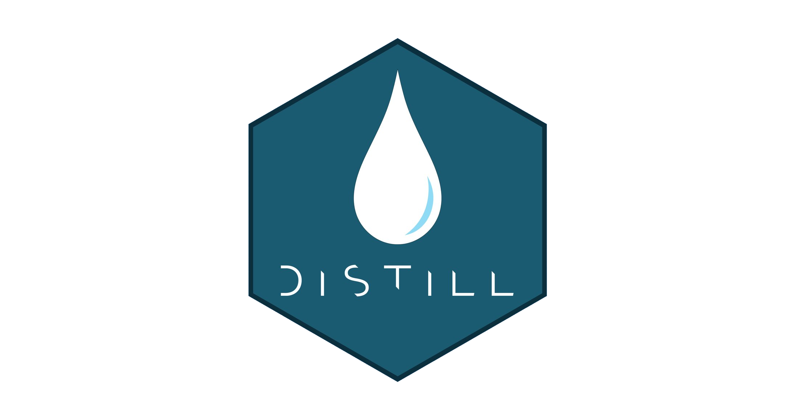

```{r setup, include=FALSE}
knitr::opts_chunk$set(echo = T)
library(tidyverse)
```

I recently moved my collection of posts from blogdown to distill. What pulled me to the latter was the perspective of a simpler, yet effective means to put posts on the web. Blogdown undoubtedly can be a very powerful tool, the web is full of visually very appealing blogs and the speed of its underlying Hugo language seems unrivaled.

<aside>
```{r, echo=F, preview=F}

```
</aside>

Yet, after using it for about a year or so, I found the lack of/the required work to get some features too cumbersome or at least to intimidating. Hence, the move to distill.

Among the helpful resources which made the transition rather smooth, I'd like to particularly highlight the documents on RStudio's distill [site](https://rstudio.github.io/distill/){target="_blank"}, [Thomas Mock's](https://themockup.blog/posts/2020-08-01-building-a-blog-with-distill/){target="_blank"} and [Lisa Lendway's](https://lisalendway.netlify.app/posts/2020-12-09-buildingdistill/){target="_blank"} related posts. I also found it helpful to have a look at the code underlying the blogs of [Miles McBain](https://milesmcbain.xyz/){target="_blank"} or others who have made their repositories publicly available on github. And last but certainly not least, the authors and maintainers of the package were overwhelmingly quick to respond to issues I had posted on [github](https://github.com/rstudio/distill){target="_blank"}. So essentially, I don't have much too add, except a few details which I haven't seen raised somewhere else and might be useful for other considering the switch. Note that all the below comments refer to `distill`'s version 1.2. 


# Search function
Distill comes with a search function which can be [activated](https://rstudio.github.io/distill/blog.html#site-search){target="_blank"} by setting the pertaining option to true in the site's yml file. Two points here:
1) The *search field will become visible only after having the site deployed*. I was wondering for a while what was wrong with my setup since the search field didn't show up. An alternative is to test-run the site with the `servr` package (ty to [jjallaire](https://github.com/rstudio/distill/issues/264){target="_blank"}).

Another issue I encountered pertains to the speed of the search function. As far as I can tell, the search function 'scans' the `post.json` file which comprises the contents of all posts (it's located in the `_site/post/` folder). Most of my posts contain tables, sometimes comprising a few thousand rows. Also, almost all of my posts contain a graph or two produced with the `ggiraph` package. Both, but particularly the latter, can create very very long entries in the post.json file. The consequence is that the *search function becomes very slow, or as in my case, even freezes due to a bloated `post.json`*. 

To overcome this obstacle, I first build the blog, producing the large `post.json` file, and afterwards run a script removing everything that is between the `<svg>` and `</svg>` tags. Plots created by `ggiraph` are svg files.

```{r, eval=F}
library(tidyverse)
library(jsonlite)

post <- readr::read_file(file=here::here("_site", "post", "post.json"))
post <- str_remove_all(post, regex("<svg.*?\\\\/svg>", dotall=T))
readr::write_file(post, file=here::here("_site", "post", "post.json"))
```

And only *afterwards* I push the blog to netlify via github. The drawback that this content is missing from the search results is in my opinion negligible, since the code which produces the svg is still there (and can be searched for in the unlikely case users are searching code snippets). Maybe there's a better approach, and probably at one point the distill package can take care of these issues, but so far this worked for me.

# Speed
An issue which might be not bother everyone is the blog's performance, i.e. how quickly it is loaded in the browser. Moving from blogdown I was curious to see whether there is actually a difference and used Google's [Pagespeed](https://developers.google.com/speed/pagespeed/insights/){target="_blank"} service to get a clearer idea. Unfortunately, the result is imho somewhat sobering.

While the blog featured a value of 96 on blogdown, it now has 'only' 85 on distill. For mobile devices the value is even only 61. I am by no  means an expert on site performances etc, but with longer and data heavy posts I can definitely see the difference. I fear the speed of blogdown is something I'll miss.

# Location of data sources
When starting with the distill blog, I wasn't sure where to actually put my heavy data sources. Putting them in to the `_post` folder would mean that they are automatically copied into the `_site` folder every time when building the blog. And more than once, when pushing the site to github I ran subsequently into serious trouble because of exceeding the 100 MB file size limit. The solution, I came up with is to put all data sources into a folder called `_blog_data`. The critical thing here is that folders or files starting with an underscore will not be copied when building the blog. So far this approached worked well for me (since I haven't figured out the git command to permanently ignore files larger than 50 MBs.) 

# Theming via css
Blogdown offers a myriad of options to theme and style your blog. Maybe too many, for my liking. Distill, on the other hand, comes with a uniform style, but nevertheless offers a few options via the underlying css. Since I turned quite a few of those css-screws (mostly in a trial and error manner), here the [link](https://github.com/werkstattcodes/distill_clean/blob/master/theme.css){target="_blank"} to actual file where I added some comments. Maybe it's helpful for some.


